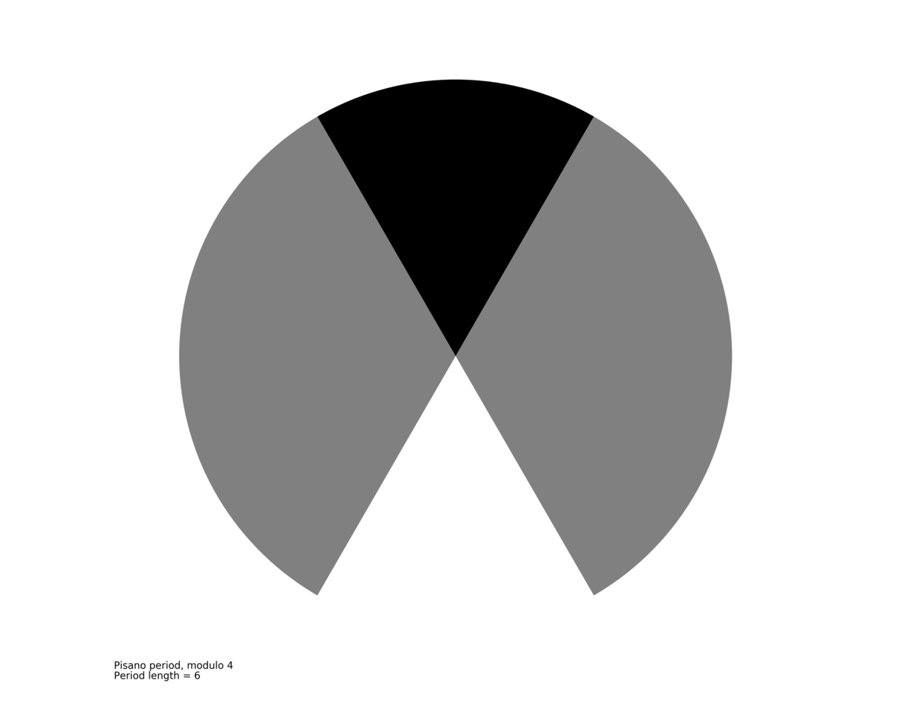
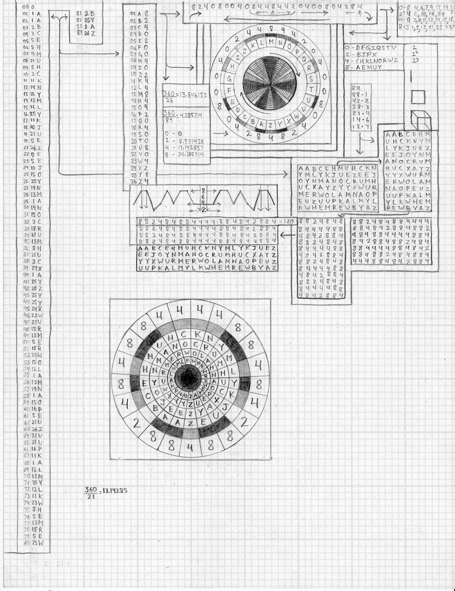
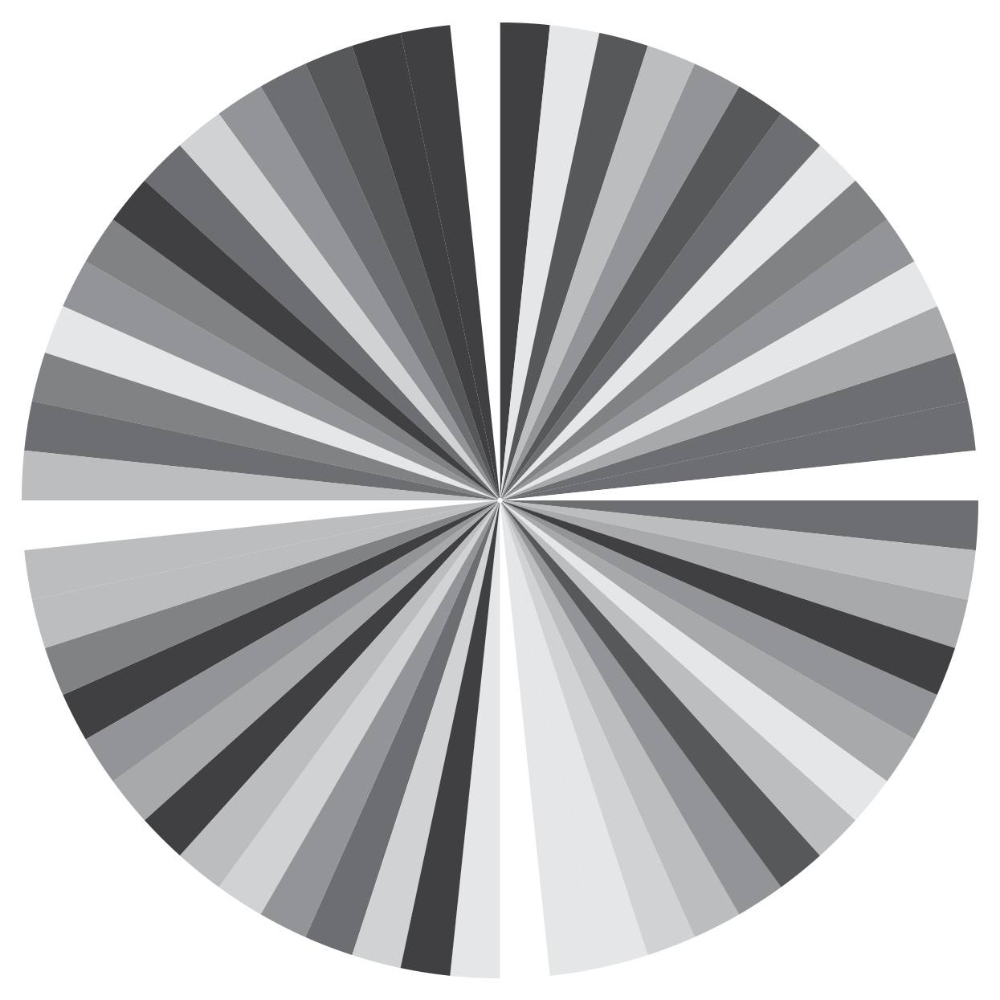
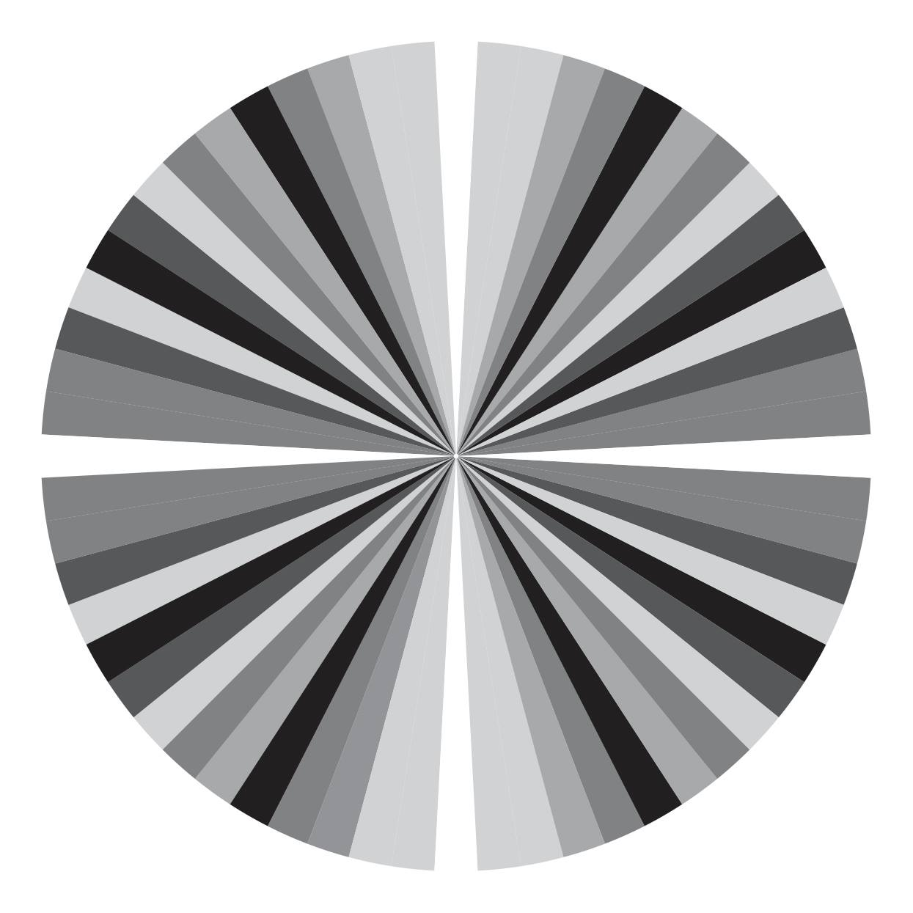
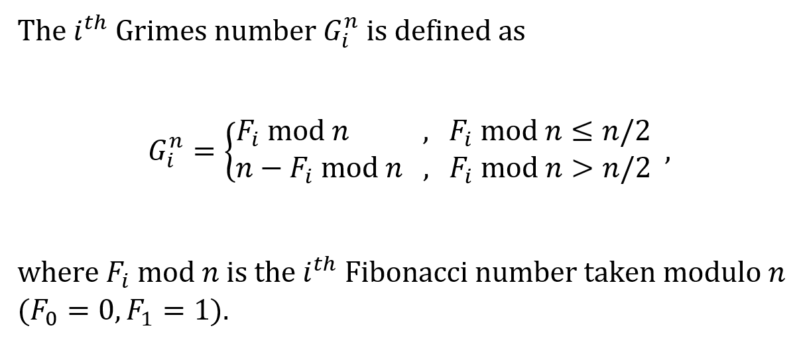
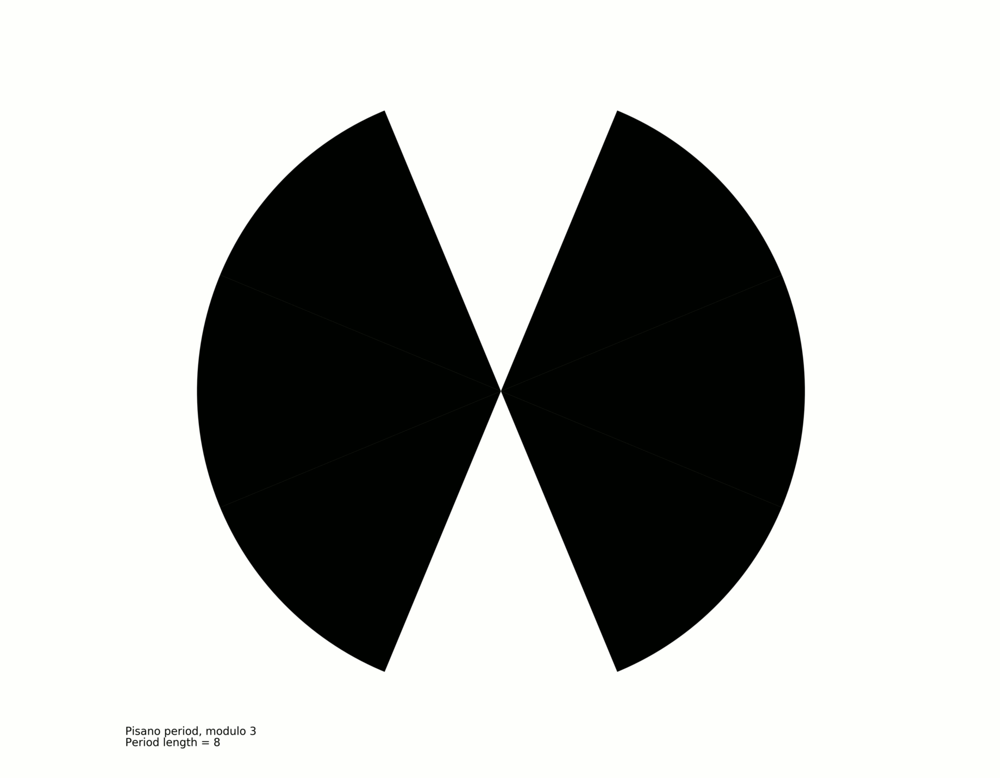
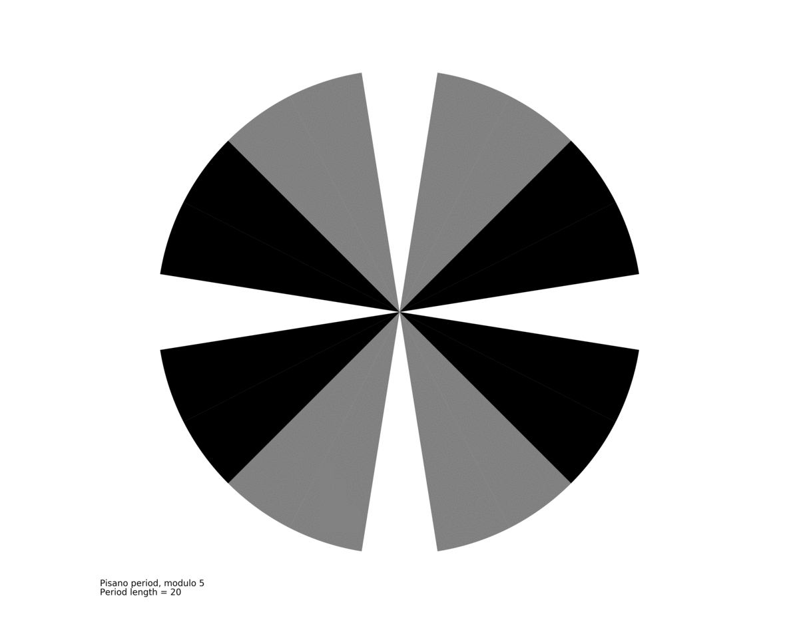
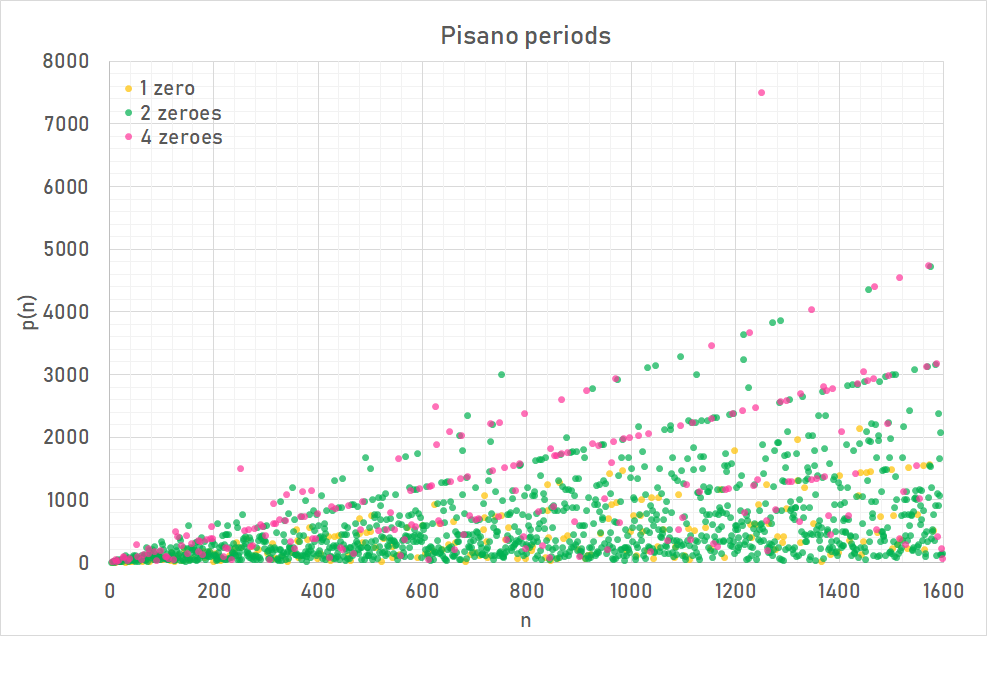

# pisanoWheels
A visualization of patterns within patterns within patterns within the Fibonacci sequence. 



## The beginnings
In 2010, artist [Nathan Grimes](http://nathangrimesfineart.com/) began a study looking for patterns within the Fibonacci sequence. Some time after, he wrote:

> I developed an algorithm using our 26 character alphabet to discover patterns within the Fibonacci sequence. With these alpha-numeric values I derived a key. From this I assigned grey-scale values to the alpha reference frequency, in order to visualize patterns. In the future I may use similar cipher/key based processes to transform my poetry into paintings and vice versa.



In 2017 Grimes revisited this study and simplified it to simply a visualization of these patterns internal to the Fibonacci sequence and wrote about his findings:

> In the Fibonacci sequence, the last digit (one's place) cycle repeats every 60 numbers. In image one, 0 to 9 are assigned grey scale values 0 = white, 9 = black, and graphed radially. For the second image, the number line 0 1 2...9 has been theoretically looped into a number circle to account for the cyclical nature of this sequence. With the number circle, 9 is followed by 0. Using the previous grey scale values, this would place white next to black, which seems abrupt and illogical for a continuum. Instead, I used the absolute value from 0 on the number circle, making 5 the largest number, and thus the darkest, so 0 1 2 3 4 5 6 7 8 9 became 0 1 2 3 4 5 4 3 2 1. Image two reveals some very intriguing symmetry. *This is most likely old news to mathematicians*, but as an unwitting amateur, having recognized the patterns from visual research, I find it exciting.  
> 
> This is the full one's place cycle:
> 
> Image one:
```0 1 1 2 3 5 8 3 1 4 5 9 4 3 7
0 7 7 4 1 5 6 1 7 8 5 3 8 1 9
0 9 9 8 7 5 2 7 9 6 5 1 6 7 3 
0 3 3 6 9 5 4 9 3 2 5 7 2 9 1    
```

>
> Image two:
```
0 1 1 2 3 5 2 3 1 4 5 1 4 3 3
0 3 3 4 1 5 4 1 3 2 5 3 2 1 1
0 1 1 2 3 5 2 3 1 4 5 1 4 3 3
0 3 3 4 1 5 4 1 3 2 5 3 2 1 1
```


## Inventing the wheel
Grimes was half-correct about this pattern being old hat for mathematicians. He had stumbled onto the [Pisano period](https://en.wikipedia.org/wiki/Pisano_period). From Wikipedia:

> The *n*th Pisano period, written as *π(n)*, is the period with which the sequence of Fibonacci numbers taken modulo *n* repeats. Pisano periods are named after Leonardo Pisano, better known as Fibonacci. The existence of periodic functions in Fibonacci numbers was noted by Joseph Louis Lagrange in 1774.

He had found *π*(10).

While the mathematical concept of the Pisano period has been around for centuries, the idea of looping the digits of the ones place and translating the results to grayscale for visualizaion, as Grimes describes above, was a novel one. Upon discovering the Pisano period, he began to tinker with the pattern that resulted from "looping" the periods from different modulos.

I formalized the description of the "Grimes number" as such:



With an infinity of modulos to create in infinity of these grayscale wheels, I offered my help in automating the creation of the wheels that Grimes had thus far been creating by hand (as much as one can create a thing by hand on a computer; he had at least moved on from graph paper sketches).

I found a [Python function by Andrew Rowles](https://github.com/rowles/Pisano-Period) which generated Pisano periods. I simply augmented this function to calculate the Grimes number of each number in the Pisano period, convert it to grayscale, and plot it in a pie chart.

## Finding new patterns
We were not sure what to do with the thousands of these wheels I had generated. But as I looked through all of them that I had generated, I thought that I saw even more underlying patterns. Certain wheels seemed to be the next iteration of another. It wasn't so clear at first, but after visual inspection and a rabbit hole expedition through a table I generated, I found what I thought to be some of the sequences of wheels that belonged together. I threw them into GIFs to watch their patterns more or less unfold before my eyes.



*modulos 3, 8, 21, 55, 144, 377, 987, 2584, 6765, 17711, 46368, 121393, 317811*



*modulos 5, 13, 34, 89, 233, 610, 1597, 4181, 10976, 28657, 75025, 196418*



*Exploring a table of data output from `PisanoPeriodTable.py`.*

## The code and the data

The code is some of my first Python code. It's ugly, but it got the job done, so I present it as-is. I've also included [a subset of the wheels that I generated and the spreadsheet I used to explore the patterns within the data](data/). I've forgotten more than I remember about finding those patterns, but perhaps one day I can pick up where I left off. For now, take pleasure in watching the sequences of Grimes number wheels unfold.
